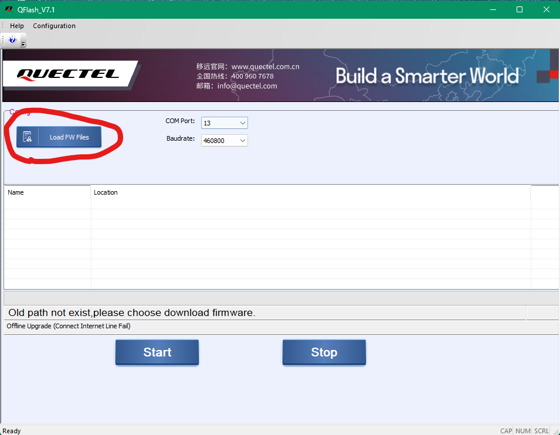

Quectel Modem Wiki
=================================
> :book: This is a living Wiki. Changes may be made as more discoveries are made or more community software is made. If you feel like you have information to contribute to this wiki please open a pull request.

# Using Qflash to flash a modem

These directions are written with Qualcomm based M.2 modems in mind. 
### File Path Note

>:bulb: Both the path to Qflash and your extracted firmware must not have spaces in it. Example: C:\Quectel\Q flash\ is bad while C:\Quectel\Qflash\ is good. If you installed Qflash and got your firmware through [QuecDeploy](https://github.com/iamromulan/QuecDeploy/releases) then you don't have to worry about this. 

Step 1.
> Install the latest NDIS Driver (Note that only one driver can be installed at once besides the ECM driver) Get it from [QuecDeploy](https://github.com/iamromulan/QuecDeploy/releases) or from my [Mega Public Folder](https://mega.nz/folder/CRFWlIpQ#grOByBgkfZe5uLMkX2M2XA) 

Step 2.
> Connect modem to your computer, by USB

Step 3.
> Go to device manager and check if the new COM ports are visible in the system. Restart your computer if the new COM ports are not visible.

> Remember the number of the COM port described as "DM Port".

Step 4.
> Open Qflash 

> Ensure your firmware is downloaded and extracted from the zip and no spaces are in the path to it/where its saved. Click Load FW Files.

> In the new window, go to the `\update\firehose` folder of the firmware and select the `partition_complete` file or the `prog_firehose` file. Then click the Open button. 

> If you downloaded your firmware with [QuecDeploy](https://github.com/iamromulan/QuecDeploy/releases) then go to C:\Quectel\firmware\<modem>\<type>\<firmware>\update\firehose\

Step 5.
> Select the COM port number as the DM port from step 3 and set the baud rate to `460800`

Step 6.
> Start updating modem firmware.

At the end of the flash process the modem will automatically reboot and QFlash shoudl say PASS!

If you get any errors ensure the USB connection is stable or try a different computer. Once the flash process makes it past the beginning loading bar phase do not interrupt the process or you could leave the modem in an unusable bricked state. You'll have to enter EDL manually to revive it if this happens.

# Advanced

# Using QFIL to flash a modem

(coming soon)