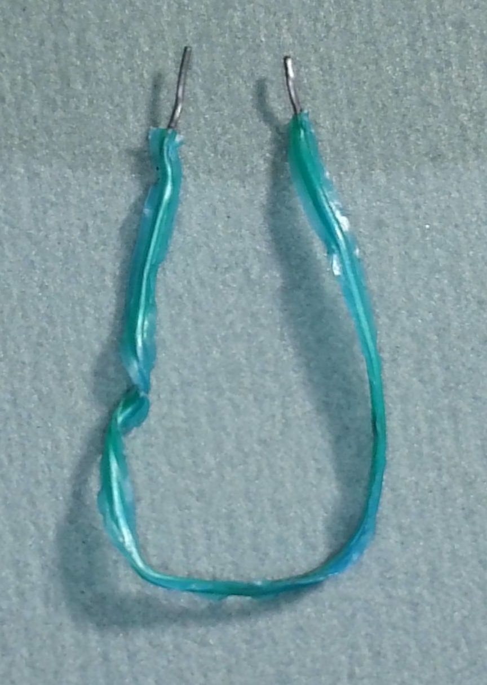
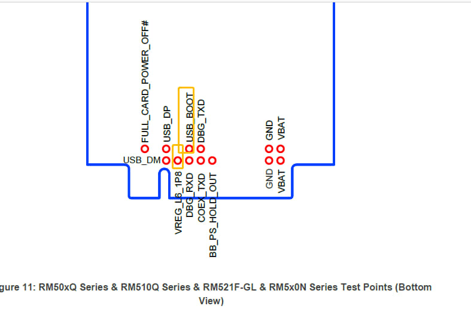
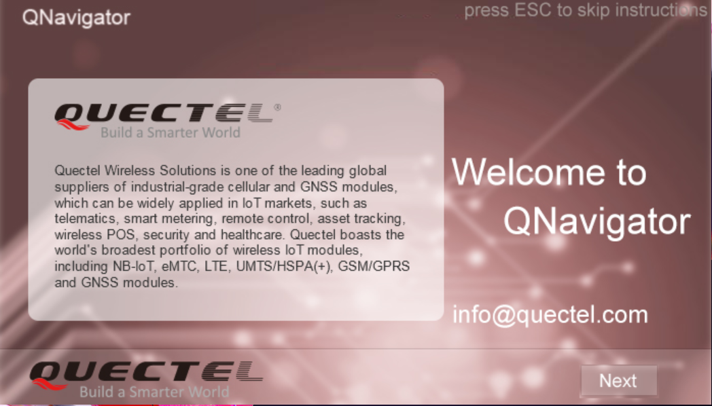

Quectel Modem Wiki
=================================
> :book: This is a living Wiki. Changes may be made as more discoveries are made or more community software is made. If you feel like you have information to contribute to this wiki please open a pull request.

# RM521F-GL


>:warning: The RM521F-GL never made it out of the Engineering Sample phase and is no longer produced. The RM550V-GL is Quectel's new X70 platform modem and does 3xCA NR SA just like the RM521F-GL. It is advisable however, to go for a [RM551E-GL](https://github.com/iamromulan/RM551E-GL/) which is capable of 5xCA on SA NR and is similar in price.

The Quectel RM521F-GL is a cellular NR/LTE (5G/4G) M.2 B-Key modem module specially optimized for a variety of applications and usage scenarios utilizing the Qualcomm x65 platform.

You will find Tools, Docs, and Firmware for it here, as well as a .exe (QuecDeploy) that installs everything for windows.

# Table of Contents

- [QuecDeploy](#quecdeploy)
- [Where to Buy](#where-to-buy)
- [Toolz](#toolz)
- [Firmware](#firmware)
- [Firmware update instructions](#firmware-update-instructions)
- [Enter Emergency Download Mode](#edl-mode)
- [How to use Qnavigator to send AT commands](#how-to-use-qnavigator-to-send-at-commands)
- [AT commands](#at-commands)
- [Other Docs](#other-docs)
- [Description of antenna connection](#description-of-antenna-connection)
- [Specification](#specification)


## QuecDeploy:


**[QuecDeploy DOWNLOAD](https://github.com/iamromulan/QuecDeploy/releases)**

> :bulb: **Note:**

If you would prefer to simply explorer all of the downloads I can give you; take a look at my [Mega Public Directory](https://mega.nz/folder/CRFWlIpQ#grOByBgkfZe5uLMkX2M2XA)

**What this does**

It is a menu style Powershell script that will let you install Qflash and Qnav. ADB and fastboot are now automatically included with Qflash! It will also let you download firmware and view PDFs for several modems (by linking you to the correct repo). It heavily relies on megatools, a cli for downloading files from mega.nz
All files installed/downloaded will go to C:\Quectel\

## Where to buy

Currently the cheapest place I know to purchase an RM521F-GL modem is: [AliExpress](https://www.aliexpress.us/item/3256806095725614.html?spm=a2g0o.productlist.main.67.1ec0cqoxcqoxvk&algo_pvid=3c6eabc4-bc5f-48d9-8b7b-661b7d21bfe6&algo_exp_id=3c6eabc4-bc5f-48d9-8b7b-661b7d21bfe6-31&pdp_npi=4%40dis%21USD%2138.95%2138.95%21%21%2138.95%2138.95%21%402103146f17232383989501000edf5f%2112000036597223958%21sea%21US%212731139720%21X&curPageLogUid=9pFh6rndCN3r&utparam-url=scene%3Asearch%7Cquery_from%3A) for $244 + shipping

Be sure to select the modem itself and not just the adapter board only when purchasing.  

## Toolz:
<details>
   <summary>Windows | View</summary>

[Quectel Windows USB Driver(Q) NDIS V2.7](https://mega.nz/file/zJd1CYbL#OuzK4SaghBZuQ_RLstw--I38179sZM7TkkktL2IIsm4) (Recommended)

[Quectel Windows USB Driver(Q) ECM V1.0](https://mega.nz/file/7IEjESSB#5jj1v7F3WWVfy6cFzdvfCHxaoTENMgBW2v_94NtgpoA)

[Quectel Windows USB Driver(Q) MBIM V1.3](https://mega.nz/file/XRc0nZSQ#9hPjcrasgOQ9ej_tWQhvC6_NQC3iZMIdu0t17sz7AHE)

[Quectel Windows USB Driver(Q) RNDIS V1.1](https://mega.nz/file/vRN1ERaL#0zp9di4iFEaamkczsmw_Xaxr3fcWS7in9ODXZ73l8Lg)

[Quectel Windows PCIe Driver 1.0.0.2](https://mega.nz/file/qVlQFTaL#Fdpcf7jpl-Cg_eoauRU0U1k2jUcF2Zqv88F6SaOf8ig)

[QFlash V7.1 EN](https://mega.nz/file/bdUWiKSQ#7RPymUcm7Rgdjf9mRsWjuf9zXia5qxV7NZWMLruvb5A) 

[QFlash V6.9 EN](https://mega.nz/file/vdFH0LrB#lnrp3G4HEmgcwGTViQzpFm2iNxBYe5k_EkdGRvglJdA)

[QFlash_PCIE_V1.0](https://mega.nz/file/SB9C3JqR#1qrUfTIzL0n-Wwpsnz8MIDjH4rifp5V8Tshax5Te7Ho)

[Qnavigator V1.6.10](https://mega.nz/file/2RMFAbCT#zq3r9TmEF8REXK6PkuAXFiuyPI5Tw4oqYnHGEiSmoD4)

[QCOM V1.8.2](https://mega.nz/file/CVcFgQLI#b1AfPvmIq9N_MHQBi8MkZFphADdW3Af7Hc8kFH0LiW8)

</details>

<details>
   <summary>Linux | View</summary>

[QFirehose V1.4.17](https://mega.nz/file/HNdEHI5I#tbOhCRS5vNZ-J9eEVVD_ip-YrU2cIYeD9bLO0j24gz4)

[Quectel Linux PCIE MHI Driver V1.3.3](https://mega.nz/file/fE8T1bRZ#U3WfgbiJZpui4rQ9zBuQnGuwLJu4FaQJsWYTvvPnHhI)

[Quectel Linux Android SPRD PCIE Driver V1.1.1](https://mega.nz/file/uBk3GDRA#3iILSy8HrFaC9Ug1xV1qmOlsz_UTfM6WD4_0lgFAZ30)

[Quectel Linux Android QMI WWAN_Driver V1.2.1](https://mega.nz/file/LcsVzLjT#jBPdvFz00TBcNef3uQ1KxxnftkVl4qchZ_aTLQuY-2E)

[Quectel Linux Android GobiNet Driver V1.6.3](https://mega.nz/file/TZczXQxa#pEjC2KJoDJISxdgGyNyqOJ3Wf8eNViTdUa5snNL0G8c)

[Quectel Android RIL Driver V3.6.14](https://mega.nz/file/yEs1GTQK#fl-i61X19PEe_zVbKSahlo4SmL10ADfrmZNoJkYLOGs)

</details>

## Firmware:

| Date         | Version               | Link                                                                                             |
| ------------ | --------------------- | ------------------------------------------------------------------------------------------------ |
| `2023-09-19` | *RM521FGLEAR05A02M4G* | <a href="https://mega.nz/file/SJN0mQwZ#C7EicrIRcGRG2bsz92Q27VA_zfTE6IAfFTgiUsbanYk">Download</a> |
|              |                       |                                                                                                  |


# Firmware update instructions:

### Windows

Step 1.
> Install modem drivers [Quectel Windows USB Driver(Q) NDIS V2.7](https://mega.nz/file/zJd1CYbL#OuzK4SaghBZuQ_RLstw--I38179sZM7TkkktL2IIsm4)  on your system. The [QuecDeploy](#quecdeploy) tool will help you do this as well. If you don't already have QFlash 7.1 install it from the [QuecDeploy](#quecdeploy) tool or the respective link in [Toolz](#toolz)

Step 2.
> Connect modem to your computer, by USB

Step 3.
> Go to device manager and check if the new COM ports are visible in the system. Restart your computer if the new COM ports are not visible.


> Remember the number of the COM port described as "DM Port".

Step 4.
> Open Qflash 

> Remember to avoid spaces in the path where QFlash is installed to and firmware location
> :bulb: Example: C:\Quectel\Q flash\ is bad while C:\Quectel\Qflash\ is good (If you installed Qflash and downloaded your firmware with [QuecTool](#quectool) then you don't need to worry about this.)
> Click Load FW Files.


> In the new window, go to the `\update\firehose` folder of the firmware and select the `partition_complete` file. Then click the Open button. 

>If you downloaded your firmware with [QuecDeploy](#quecdeploy) then go to C:\Quectel\firmware\RM520NGL\type\fimrware\update\firehose\


Step 5.

> Select the COM port number as the DM port from step 3 and set the baud rate to `460800`


Step 6.
> Start updating modem firmware.


### Linux: OpenWRT

Step 1.
> Install the qfirehose package.
> In console, run commands.

``` bash
opkg update
opkg install qfirehose
```
Step 2.
> Using WinSCP, copy the extracted modem firmware to the \tmp folder on the router.

Step 3.
> Start updating modem firmware.
> In console, run command.

``` bash
/usr/bin/qfirehose -f /tmp/RM520NGLAAR03A02M4GA
```


# EDL Mode

  
### If  for some reason something gets messed up on your modem and you are not able to see the DM port to flash firmware, there's a way to enter EDL mode (Emergency Download Mode)

Typically when you flash firmware the [normal method](#firmware-update-instructions) you use Qflash and select the DM port. When you click start, Qflash tells the DM port (Diagnostics port) to reboot into EDL mode. When the module comes back up only one port will exist: The QDLoader port. This means the modem has entered EDL mode. Qflash will then proceed to flash.

 It is also possible to enter EDL mode by using adb.
The command is:
``adb reboot edl``

However, if you have nothing showing up at all (the modem won't boot) then this is the manual way to enter EDL mode:
### Step 1
Find a m.2 board where the slot is on the edge. That way you can see the back of the module. For this example, I will use the [Rework.Network Ethernet M.2 Board](https://rework.network/collections/lte-home-gateway/products/5g2phy)

It is also possible to take a regular M.2 to USB adapter and cut the board so the back of the modem will be visible. This is dependent on the circuity layout of the particular m.2 to USB adapter board.

### Step 2
**Place the modem in the board and turn it upside down on a static free surface, and connect the USB cable to the board. Be prepared to connect it to you PC but don't do it yet.**

### Step 3

For the RM500-RM530 series modems, you'll need a small wire or cable tie. I ended up striping the ends off a cable tie. See below.....


### Step 4
Open Device manager on your PC and keep and eye on the ports section.
Using the tool from step 3, trip the 2 contacts on the back of the modem **at the same time as plugging the USB to your PC**.  If you are successful, the QDLoader port should instantly appear. You do not need to keep the 2 contacts on the back tripped after you plug it in and see the QDLoader port. If the QDLoader port doesn't show up within 3 seconds, unplug the USB and try again.

For the RM500-RM530 modems these are the correct ports to jump:


**Here is how I did it. Remember plug the USB in at the same time as doing this:**


### Step 5

At this point you should see the QDLoader port in device manager:


Follow the steps from the [normal method](#firmware-update-instructions) and treat the QDLoader port as the DM port.

# How to use Qnavigator to send AT commands


Connect your modem to your computer by USB. Either through a USB to m.2 B-key sled (should have a sim slot as well) from Amazon or by using a PCIe RC (RJ45 sled) USB C port.
### If you installed by using [QuecDeploy](#quecdeploy): 
You should already have a desktop icon and start menu shortcut for Qnavigator.
#### 1. Open Qnavagator, you'll be presented with this screen, just press escape (ESC) to skip their directions. 

#### 2. Uncheck Automatic initialization (circled in red) and click the COM plug icon (circled in green)

#### 3. Click ok, the correct port will already be auto selected

#### 4. Click Connect to module, then in the lower right type your AT command and press send. The response will be shown above.


## AT commands:
<details>
   <summary>View</summary>


| Date | Version | Link |
| --- | --- | --- |
| `2024-02-07` | *RM50X and RM52X series modems AT Commands (some apply to RM550/551)* | <a href="https://mega.nz/file/WZsgHZ7C#XcE0LPkzgb_aS7o8yEeCMSEA_YzCxflXBgfxOsOrt3M">View/Download</a> |
| `2023-07-31` | *RM50X and RM52X series modems AT Commands* | <a href="https://mega.nz/file/mNFyxD6K#Y_YVlSEWNn9tz9dpHvY1rSZuDR_gEB6XEVIQ0nGrCJQ">View/Download</a> |
| `2022-08-12` | *RM50X and RM52X series modems AT Commands* | <a href="https://mega.nz/file/WRFQSLIY#leMbHiKL_jmEy2LZMp1-3aI2BLW2m8vkNFl8ApT3FQw">View/Download</a> |
| `2021-08-09` | *RM50X and RM52X series modems AT Commands* | <a href="https://mega.nz/file/vEE1lR4L#FS1_8YIZgqEEcyjWG1__RMI5IeiTc6yrwU9xw6bCpsQ">View/Download</a> |
| `2020-10-09` | *RM50X and RM52X series modems AT Commands* | <a href="https://mega.nz/file/HcVVAA7Q#QuJZIaN0EkBvLYqFhSUCv_qjx0aGsSG04VXUp1huATw">View/Download</a> |

</details>


## Other Docs

Various Documents can be found here:
https://mega.nz/folder/LAM0DDpC#YQdQZfVVao-H_-eeyAYl3w

## Description of antenna connection:
 


