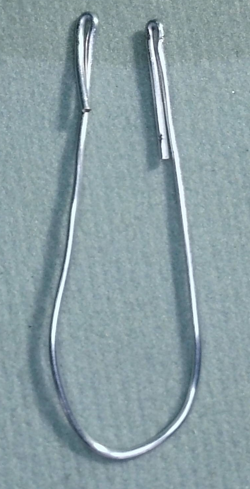
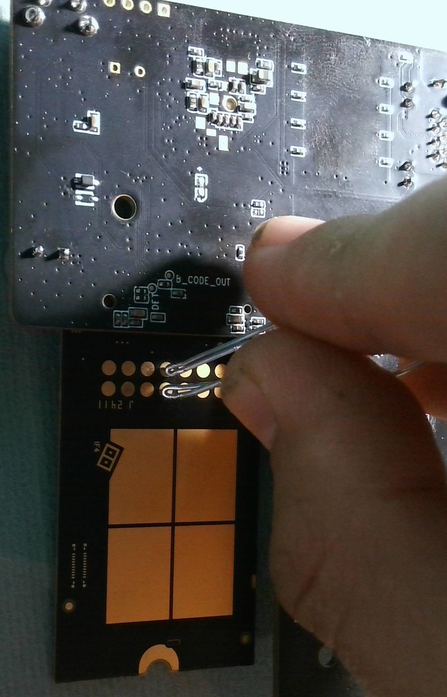

Quectel Modem Wiki
=================================
> :book: This is a living Wiki. Changes may be made as more discoveries are made or more community software is made. If you feel like you have information to contribute to this wiki please open a pull request.

## EDL Mode

### If  for some reason something gets messed up on your modem and you are not able to see the DM port to flash firmware, theres a way to enter EDL mode (Emergency Download Mode)

Typically when you flash firmware the [normal method](#firmware-update-instructions) you use Qflash and select the DM port. When you click start, Qflash tells the DM port (Diagnostics port) to reboot into EDL mode. When the module comes back up only one port will exist: The QDLoader port. This means the modem has entered EDL mode. Qflash will then proceed to flash.

 It is also possible to enter EDL mode by using adb.
The command is:
``adb reboot edl``

However, if you have nothing showing up at all (the modem won't boot) then this is the manual way to enter EDL mode:
### Step 1
Find a m.2 board where the slot is on the edge. That way you can see the back of the module. For this example, I will use the [Rework.Network Ethernet M.2 Board](rework.network/collections/lte-home-gateway/products/5g2phy)

It is also possible to take a regular M.2 to USB adapter and cut the board so the back of the modem will be visible. This is dependent on the circuity layout of the particular m.2 to USB adapter board.

### Step 2
**Place the modem in the board and turn it upside down on a static free surface, and connect the USB cable to the board. Be prepared to connect it to you PC but don't do it yet.**

### Step 3

For the RM550/551 modems, you can use a paper clip. Be sure to bend the ends so the sides the paper clip can be used instead of the tips. See below.....

### Step 4
Open Device manager on your PC and keep and eye on the ports section.
Using the tool from step 3, trip the 2 contacts on the back of the modem **at the same time as plugging the USB to your PC**.  If you are successful, the QDLoader port should instantly appear. You do not need to keep the 2 contacts on the back tripped after you plug it in and see the QDLoader port. If the QDLoader port doesn't show up within 3 seconds, unplug the USB and try again.

For the RM550/551 modems these are the correct ports to jump:

**Here is how I did it. Remember plug the USB in at the same time as doing this:**

### Step 5

At this point you should see the QDLoader port in device manager:

 

Follow the steps from the [normal method](#firmware-update-instructions) and treat the QDLoader port as the DM port.